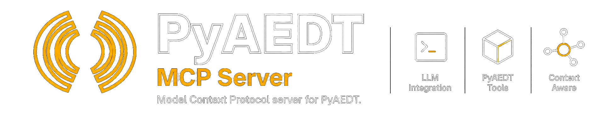

<p align="center">
  
</p>

# PyAEDT MCP Server

[](https://www.python.org/)
[](https://opensource.org/licenses/Apache-2.0)

`ansys-aedt-mcp` is an MCP server for Ansys Electronics Desktop (AEDT). It gives an AI client a small set of reliable AEDT tools, plus a persistent PyAEDT-backed Python session for the steps that do not fit a dedicated tool.

## What it does

The server is built around one runtime loop:

1. Check whether AEDT is installed or already reachable.
2. Launch AEDT or connect to an existing gRPC session.
3. Open projects, create designs, run analyses, inspect the model, and export results.
4. Fall back to `run_python_code` or `run_python_script` for custom PyAEDT work.

Supported AEDT applications include HFSS, Maxwell 2D/3D, Q2D, Q3D, Icepak, Circuit, TwinBuilder, Mechanical, EMIT, RMXprt, and HFSS 3D Layout.

## Install

### Run without cloning

```bash
uvx --from git+https://github.com/ansys/pyaedt-mcp.git ansys-aedt-mcp
```

### Install locally

```bash
pip install git+https://github.com/ansys/pyaedt-mcp.git
```

### Install for development

```bash
git clone https://github.com/ansys/pyaedt-mcp.git
cd pyaedt-mcp
pip install -e ".[dev]"
pre-commit install
```

## Requirements

- Python 3.10 or later
- AEDT 2022 R2 or later for gRPC workflows
- A local AEDT installation, or a reachable remote AEDT gRPC endpoint

## Quick start

### 1. Start AEDT in gRPC mode when connecting to an existing session

```bash
"C:\Program Files\ANSYS Inc\v261\AnsysEM\ansysedt.exe" -grpcsrv 50051
```

### 2. Start the MCP server

```bash
ansys-aedt-mcp
```

Common variants:

```bash
# Connect on startup
ansys-aedt-mcp --connect --machine localhost --port 50051

# Expose HTTP transport instead of stdio
ansys-aedt-mcp --transport http --http-host 127.0.0.1 --http-port 8080

# Register optional context helper tools
ansys-aedt-mcp --include-context

# Hide AEDT-only tools until a connection exists
ansys-aedt-mcp --dynamic-tool-discovery
```

### 3. Point an MCP client at the server

#### VS Code

```json
{
  "mcp": {
    "servers": {
      "pyaedt-mcp": {
        "command": "uvx",
        "args": [
          "--index-strategy", "unsafe-best-match",
          "--from", "git+https://github.com/ansys/pyaedt-mcp.git",
          "ansys-aedt-mcp"
        ]
      }
    }
  }
}
```

#### Claude Desktop

```json
{
  "mcpServers": {
    "pyaedt-mcp": {
      "command": "uvx",
      "args": [
        "--from", "git+https://github.com/ansys/pyaedt-mcp.git",
        "ansys-aedt-mcp"
      ]
    }
  }
}
```

## Tool surface

| Area | Main tools |
| --- | --- |
| Lifecycle | `check_aedt_installed`, `check_aedt_status`, `launch_aedt`, `connect_to_aedt`, `disconnect_from_aedt`, `clear_aedt` |
| Project management | `list_projects`, `list_designs`, `open_project`, `save_project`, `create_design` |
| Simulation | `analyze_design`, `export_config` |
| Scripting | `run_python_code`, `run_python_script` |
| Inspection | `get_model_info`, `screenshot`, `get_pyaedt_logs` |
| Results | `export_results` |
| Optional guidance | `get_guidelines_for` when the server starts with `--include-context` |

Every tool has a timeout guard so the server can fail a stalled request without taking down the whole process.

## How the repository is organized

The core package lives in `src\ansys\aedt\mcp`:

| File | Role |
| --- | --- |
| `__main__.py` | Module entry point that forwards to the CLI launcher |
| `server.py` | CLI parsing, app setup, context creation, startup cleanup, transport selection |
| `tools.py` | Runtime tool implementations for AEDT lifecycle, project, scripting, and export workflows |
| `helpers.py` | Small utilities for probing endpoints, normalizing versions, and extracting model data |
| `prompts.py` | System prompt content shown to MCP clients |
| `contexts.py` | Optional context helper tools enabled by `--include-context` |
| `toolsets.py` | `toolsets://definition` resource used for logical tool discovery |
| `aedt_helper\startup_code.py` | Startup code loaded into the persistent Python session |

Other top-level folders:

- `doc\source`: Sphinx documentation
- `tests`: unit and integration coverage
- `docker`: container assets
- `examples`: sample assets used by the project

## Development workflow

Run the main checks from the repository root:

```bash
pytest -q
python -m sphinx -W -b html doc\source doc\_build\html
pre-commit run --all-files
```

Integration tests expect a real AEDT session:

```bash
pytest tests\test_integration.py -m integration
```

## Adding a new tool

Most tools require a live AEDT connection. Tag those tools with `REQUIRES_AEDT_TAG` in `src\ansys\aedt\mcp\tools.py` so they can be hidden until the session exists when dynamic discovery is enabled.

If a tool is intentionally available before connection, leave that tag off and make sure the visibility tests in `tests\test_tools.py` still describe the expected surface.

## License

Apache 2.0 License. See [LICENSE](LICENSE).

## Related projects

- [PyAEDT](https://github.com/ansys/pyaedt)
- [PyAEDT Documentation](https://aedt.docs.pyansys.com/)
- [FastMCP Documentation](https://github.com/jlowin/fastmcp)
- [Model Context Protocol](https://modelcontextprotocol.io/)
