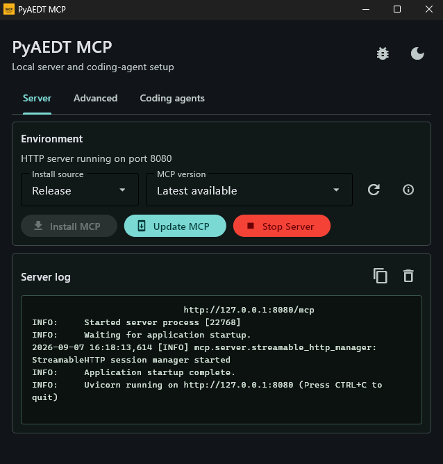
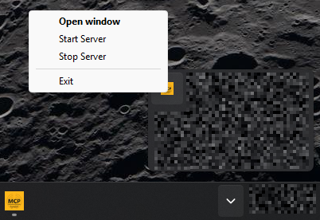
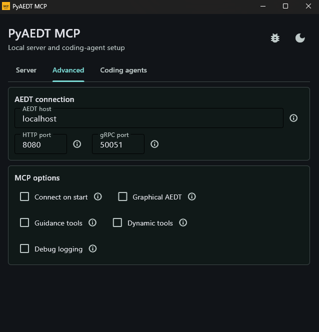
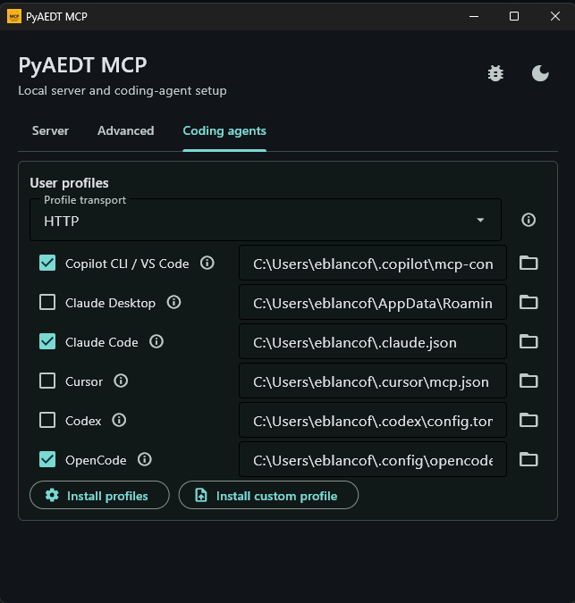

.. _ref_desktop_app:

Desktop app
===========

The PyAEDT MCP desktop app provides a Windows interface for installing and
updating the managed MCP environment, running the local HTTP server, and
configuring supported coding-agent profiles.

First launch
------------

When the managed environment has not been installed, the app opens a setup
guide. We refer as managed environment the virtual environment that the PyAEDT
MCP desktop app creates for installing and running the managed MCP environment.
By default, this environment will be available in `%APPDATA%\\.pyaedt_mcp`.

On the **Server** tab, choose an install source and MCP version, then
select **Install MCP**. After installation, the app enables **Start Server**.

Use the **Update MCP** button to update an existing managed environment. Choose
**Git branch** as the install source when testing a repository branch instead
of a published release.

Server tab
----------

Use the **Server** tab to install or update PyAEDT MCP and to start its local
HTTP transport. The **Server log** window displays standard output and errors
from the MCP server that the desktop app launches. Use it to confirm startup,
inspect debug output, and diagnose a server that exits unexpectedly.

System tray
-----------

.. warning::

	Closing the application window keeps PyAEDT MCP running in the Windows
	system tray. To exit the desktop app completely, right-click the PyAEDT MCP
	tray icon and select **Exit**.

The tray menu provides the following actions:

* **Open window** restores the control panel after it has been hidden.
* **Start Server** starts the local HTTP server with the current settings on
  the **Advanced** tab.
* **Stop Server** stops the HTTP server that was started by the desktop app.
* **Exit** stops the local HTTP server, removes the tray icon, and closes the
  desktop app.

Settings are retained while the window is hidden. Closing the window does not
stop a running server; use **Stop Server** or **Exit** from the tray menu when
the server is no longer needed.

Advanced tab
------------

The desktop app starts the server with ``--transport http`` and
``--http-host 127.0.0.1``. Use **AEDT connection** and **MCP options** to
configure the remaining server arguments:

* **HTTP port** sets ``--http-port``. The default is ``8080``.
* **AEDT host** and **gRPC port** provide the values for ``--machine`` and
	``--port`` when **Connect on start** is selected.
* **Connect on start** adds ``--connect``. The server then connects to the
	configured AEDT session at startup and locks that connection for its
	lifetime.
* **Graphical AEDT** adds ``--graphical``. Leave it unselected to use the
	default non-graphical AEDT mode.
* **Guidance tools** adds ``--include-context`` to register the optional AEDT
	and PyAEDT workflow guidance tools.
* **Dynamic tools** adds ``--dynamic-tool-discovery`` to hide AEDT-only tools
	until the server has an AEDT connection.
* **Debug logging** sets ``FASTMCP_LOG_LEVEL=DEBUG`` for the server process.

For the full list of command-line server options, including ``--version`` and
the HTTP CORS settings that are not exposed by the desktop app, see
:ref:`Advanced configuration <ref_ide_configuration>`.

Coding agents tab
-----------------

Select the coding-agent profiles to configure, choose **Stdio** or **HTTP** as
the profile transport, and confirm the configuration file path for each agent.
Select **Install profiles** to write the selected configuration files. Use
**HTTP** only after starting the local HTTP server.

